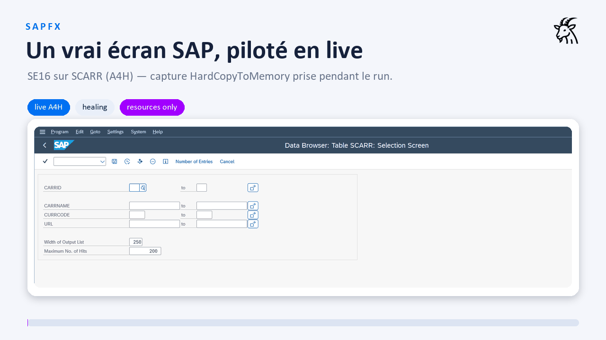

> **🇬🇧 English** · [🇫🇷 Français](README.fr.md)

# SAPFX — releases

Public distribution point for **SAPFX**, a SAP test-automation ecosystem for
[Robot Framework](https://robotframework.org):

- **SapEccLibrary** — SAP GUI desktop automation (ECC / S/4HANA backend) over
  the SAP GUI Scripting API, with structured screen perception, self-healing
  locators, human (label-based) locators and visual assertions;
- **SapFioriLibrary** — SAP Fiori / UI5 web automation next to the Browser
  library (Playwright): role / XPath / Web-Components / WebGUI resolution
  engines, launchpad iframes, visual baselines;
- **SapApiLibrary** — the API channel: OData v2/v4 with one keyword set,
  optional RFC;
- business-readable keyword resources, a desktop recorder (native Scripting
  API events) and a web recorder (Chrome MV3 extension), rf-mcp (RobotMCP)
  plugins for AI-agent-driven testing, the plan → generate → heal test
  agents, and a drift sentinel that watches screens without scripted tests.

This repository hosts **only the release artifacts** — the self-contained
**Windows deployment pack**. The source code lives in a private repository;
access on request: <cyril@montiel.me>.

## Demo

Everything above is **real**: screens captured on a live system (ABAP Platform
Trial A4H) while the library drives it — a stale locator healed mid-run
(score 97 %), the real SE16 count, the real drift report, the one-line
`resources/` patch. Healing is never silent: a runtime WARNING becomes
cumulative telemetry, which the drift-report script turns into a patch
proposal — business tests are never touched.

▶️ **[Watch the full demo video](demo/healing-live.mp4)** — a 30-second
screencast of SAP GUI driven live (transaction typed, healing, real count
popup, ALV grid), with the drift report and the applied patch.

## Download

Get `sapfx-pack-<version>-win.zip` from the [Releases](../../releases) page.

## Install (summary)

1. Unzip on the target Windows PC (Python 3.10+ on the `PATH`).
2. `install.cmd` — libraries only; `-WithMcp` adds the rf-mcp plugins and
   renders the MCP configs in place; `-WithBrowsers` downloads Playwright's
   Chromium.
3. Validate with the sample suites (`tests\robot\fiori_smoke.robot` needs no
   SAP at all).

Full instructions, prerequisites and troubleshooting: `README.md` /
`README.fr.md` **inside the pack**.

## License

Apache-2.0 — see [LICENSE](LICENSE) and [NOTICE](NOTICE) (both are also
shipped inside each pack, next to the binaries).
