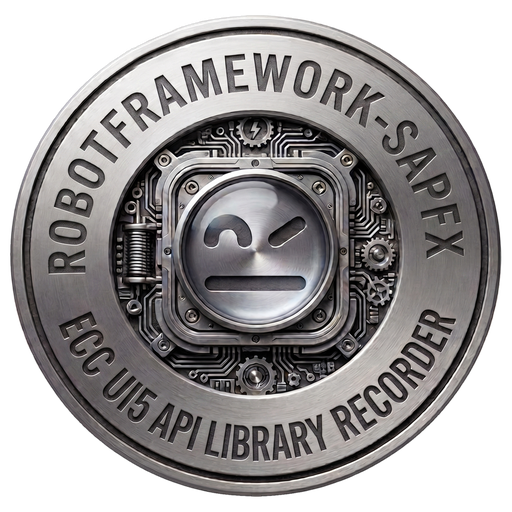

> **🇬🇧 English** · [🇫🇷 Français](README.fr.md)

<p align="center">
  
</p>

# SAPFX

SAP test automation for Robot Framework (distribution `robotframework-sapfx`)
with **one business vocabulary across three channels**:

- **`SapEccLibrary`** (phase 1) — SAP GUI thick client (ECC, S/4HANA backend),
  a hardened fork of
  [robotframework-sapguilibrary](https://github.com/frankvanderkuur/robotframework-sapguilibrary)
  (Apache 2.0), over COM.
- **`SapFioriLibrary`** (phase 2) — SAP Fiori / S/4HANA web (SAPUI5), over Playwright
  (Browser library) with **UI5-stable control selectors** (no dynamic-id churn):
  role/property matching *and* a hierarchical **UI5 XPath** engine
  (`//Table//Button[@text='Edit']`), plus a **WebGUI `sid` engine** for classic
  SAP GUI for HTML pages and a **Web Components engine** for `ui5-*` pages
  without a classic UI5 runtime. The locator engine is ported from
  [playwright-sap](https://github.com/ArpitSureka/playwright-sap) (Apache-2.0).
- **`SapApiLibrary`** — the API channel (stdlib-only): OData **v2 and v4**
  behind one keyword set (incl. the SAP CSRF protocol), optional RFC via
  pyrfc. Prepare and cross-check data through the API; drive the screen only
  for what you actually test — see the cross-paradigm flagship suite
  (`tests/robot/flagship_cross_paradigm.robot`: SE16 count == OData `$count`
  on the same live system).

A test reads the same whichever channel it drives. See
[docs/architecture.md](docs/architecture.md) and
[docs/fiori-architecture.md](docs/fiori-architecture.md).


Everything above is **real**: screens captured on a live system (A4H) while the
library drives it, a stale locator healed mid-run (score 97 %), the real SE16
count, the real drift report. The important bit: healing is never silent. A
runtime WARNING becomes cumulative telemetry, then
`scripts/healing_drift_report.py` locates the patch to make in `resources/`
without changing business tests.

▶️ **[Watch the full demo video](https://github.com/CyrilM29/robotframework-sapfx/blob/main/docs/media/healing-live.mp4)** — a 30-second
screencast of SAP GUI being driven live (transaction typed, healing, real count
popup, ALV grid), with the drift report and the applied patch.

## Where this sits — including wdi5

[wdi5](https://github.com/ui5-community/wdi5) is the reference for UI5
end-to-end testing outside Robot Framework (UI5-community project,
WebdriverIO-based, actively maintained). This project is **not** a wdi5
replacement and does not try to be one. The positioning is different: **SAP
test automation in Robot Framework**, where the SAP GUI desktop client, the
OData/RFC API channel and Fiori/UI5 share one business vocabulary, one runner
and **one report**.

- Your stack is JS/WebdriverIO and your scope is a UI5 app → wdi5 is the
  natural choice.
- Your stack is Robot Framework, or your scenario spans the desktop client,
  APIs and Fiori in the same run → that is what this project is for.

Details in [docs/fiori-architecture.md](docs/fiori-architecture.md)
(§ “Why not Selenium / raw CSS / wdi5”).

## What this fork adds over upstream

The upstream library is a solid base with good keyword coverage (including ALV
grids). This fork keeps **all** of it and adds the things production SAP automation
needs — see the full [audit](docs/audit-upstream.md):

- **Real synchronisation** instead of fixed `sleep`s — `Wait Until Busy Done`,
  `Wait Until Element Present`, `Wait Until Element Value Is`.
- **Autonomous bootstrap** — `Open Sap Logon` launches the Logon Pad and waits for
  the scripting engine; `Connect To Session With Retry`; `Close Sap Logon`.
- **Locale-independent** `Run Transaction` (reads the status-bar message *type*,
  not English/Dutch/German text) + `Status Message Should Be Success`.
- **ALV grids by column title** — `Get Cell Value By Column Title`, `Read Grid`
  (→ list of dicts), `Get Column Id By Title`.
- **Screen perception** — `Get Screen Signature` (ECC) and `Get Ui5 Page Tree`
  (Fiori): a read-only text/XML view of the live screen, for locator debugging and
  AI-agent integration. Both support `mode=diff` (only what changed since the
  previous perception).
- **Scripting preflight & telemetry** (ECC) — `Scripting Should Be Fully Enabled`
  fails early with the exact RZ11 parameter to fix; `Enable Test Tool Mode`,
  `Get Session Telemetry`.
- **Locator healing, never silent** — failures suggest the closest ids on screen
  (scored); `Resolve Element With Healing` (ECC) and `Resolve Ui5 With Fallback`
  (Fiori: role→xpath→sid→wc chain) repair a stale locator with a logged WARNING,
  feeding an opt-in telemetry journal (`SAPFX_HEALING_LOG`) that
  `scripts/healing_drift_report.py` turns into preventive maintenance
  (stable drifts located in `resources/`, patch proposed, `--apply` executes).
- **Human locators** (ECC, ported from RoboSAPiens with a stricter policy) —
  `Find/Fill/Read Field By Label`, `Click Button By Label`: visible label +
  geometry, grid positions (`N @ Label` / `Label @ N`), scoped anchor
  (`Anchor >> Rest`, tunable `scope_radius`); ambiguity always reported with
  candidates, never a silent first match.
- **Visual assertions** (ECC) — `Screen Should Match Baseline` (perceptual
  dHash over in-memory screenshots, snapshot semantics): pixel-level coverage
  for exactly what the Scripting API cannot see (opaque GuiShell lists,
  record-only charts). Optional `visual` extra (Pillow).
- **Embedded WebView2 bridge** (ECC) — `Switch To Embedded Browser Page` hands
  a WebView2 control embedded in a SAP GUI/Business Client window to the
  Browser library over CDP: both channels in one suite.
- **Launchpad iframes & Fiori Elements** — `Set Ui5 Frame` for Work Zone/cFLP
  apps embedded in a (cross-origin) iframe; stable `idSuffix=fe::…` selectors.
  Multi-version UI5: 1.60 → 2.0 nightly, proven live.
- **Recorders**, not just spies — desktop (`tools/recorder`: highlight,
  click-to-capture, hover, `--record` replayable keyword sequences with a
  **native event engine** — exact buttons/grids/trees via the Scripting API's
  `Change` events, automatic polling fallback; Tkinter launcher + root
  `recorder.cmd`) and web (`tools/recorder_web`: snippet **and** a Chrome MV3
  extension that exports a `*** Test Cases ***` body, incl. value assertions and
  iframe support). No third-party tracker.
- **rf-mcp (RobotMCP) integration** (`integrations/robotmcp/`) — `SapEccPlugin` /
  `SapFioriPlugin` plug into the [rf-mcp](https://github.com/manykarim/robotframework-mcp)
  server: keyword routing, SAP selector guidance, and live screen perception for
  AI agents. Validated end-to-end against a live A4H system and a live UI5 page.

## Layout

```text
src/SapEccLibrary/          # phase 1 — SAP GUI thick client (COM)
  _vendor/sapgui_base.py    #   upstream, vendored verbatim (class renamed only)
  keywords/_connection.py   #   bootstrap mixin (Logon Pad, retry, CoInitialize)
  keywords/_waits.py        #   synchronisation mixin (+ closest-match hints)
  keywords/_grid.py         #   ALV ergonomics mixin
  keywords/_perception.py   #   Get Screen Signature (mode=diff) + screenshots
                            #   + visual assertions (perceptual-hash baselines)
  keywords/_diagnostics.py  #   scripting preflight + TestToolMode + telemetry
  keywords/_healing.py      #   Resolve Element With Healing (logged, never silent)
  keywords/_semantic.py     #   human locators (label + geometry, grids, >> scope)
  keywords/_embedded_browser.py  # WebView2/CDP bridge to the Browser library
  SapEccLibrary.py          #   composes them + locale-safe Run Transaction
src/SapFioriLibrary/        # phase 2 — Fiori / S/4HANA web (Playwright + UI5)
  _ui5_runtime.py           #   UI5 control-selector model (pure data)
  _ui5_js.py                #   injected __SAPFX bundle: tree, XPath/role engines, sid
  regen_recorder.py         #   regenerates the web recorder (snippet + extension)
  SapFioriLibrary.py        #   resolves UI5 selectors via the Browser page
                            #   (+ Set Ui5 Frame, Resolve Ui5 With Fallback, idSuffix)
src/SapApiLibrary/          # API channel: OData v2/v4 + CSRF, optional RFC (stdlib-only)
src/sapfx_common/           # shared primitives: polling/retry, COM safety,
                            #   healing scoring + telemetry, perception diff,
                            #   object tree, semantic engine, visual hash
resources/                  # business keywords — ecc_keywords + fiori_keywords (mirrored)
                            # + a4h_demo_data (SFLIGHT/EPM demo-data guards)
tests/unit/                 # off-SAP/off-browser logic tests (run anywhere)
tests/robot/                # ecc_smoke + ecc_data_smoke + ecc_exploration (need SAP),
                            # fiori_smoke (OpenUI5 Demo Kit), fiori_sflight_smoke
                            # (local cap-sflight), compat smokes (UI5 1.60 legacy,
                            # UI5 2.0 nightly, cross-origin iframes)
                            # + recorder smokes (desktop record engine, web record mode)
                            # + flagship_cross_paradigm (GUI ↔ API ↔ Fiori cross-checks)
tools/recorder/             # desktop recorder (SAP GUI object tree, GUI launcher,
                            # native event record engine w/ polling fallback)
tools/recorder_web/         # web recorder: snippet + Chrome MV3 extension
integrations/robotmcp/      # rf-mcp plugins: keyword routing + SAP screen perception
packaging/ + scripts/       # Windows deployment pack sources + repo tooling
                            # (build_release_pack.py -> dist/sapfx-pack-<v>-win.zip)
docs/                       # architecture, fiori-architecture, mcp-integration,
                            # audit-upstream, testing-without-sap, ecc-validation,
                            # sap-test-data, deployment-pack — all bilingual EN/FR
```

## Install

```bash
pip install -r requirements.txt      # robotframework + pywin32 (pinned, Windows) + browser
rfbrowser init                       # one-time: download Playwright browsers (Fiori side)
```

SAP-side prerequisites (scripting enabled server/client) are in
[docs/testing-without-sap.md](docs/testing-without-sap.md), which also explains how
to get a **free local SAP system** to test against (ABAP Platform Trial in Docker).
The Fiori side needs no SAP at all — it tests against the public OpenUI5 Demo Kit.

## Quick start

Tests speak business language; SAP element ids stay in the resource layer
(convention: **no raw ids, no CSS/XPath in test cases**):

```robotframework
*** Settings ***
Resource    resources/ecc_keywords.resource
Suite Setup       Open SAP And Log In
Suite Teardown    Close SAP

*** Test Cases ***
Read The Clients Table In SE16
    Go To Transaction    SE16
    Display Table Contents    T000
    ${rows}=    Read Displayed Grid    max_rows=5
    Log    ${rows}

*** Variables ***
${SE16_TABLE_FIELD}    wnd[0]/usr/ctxtDATABROWSE-TABLENAME
${SE16_GRID}           wnd[0]/usr/cntlGRID1/shellcont/shell

*** Keywords ***
# In a real project these live in resources/, next to ecc_keywords.resource.
Display Table Contents
    [Arguments]    ${table}
    Input Text    ${SE16_TABLE_FIELD}    ${table}
    Send Vkey     0
    Send Vkey     8
    Wait Until Element Present    ${SE16_GRID}

Read Displayed Grid
    [Arguments]    ${max_rows}=5
    ${rows}=    Read Grid    ${SE16_GRID}    max_rows=${max_rows}
    RETURN    ${rows}
```

Run it (against a system — credentials via variables; `Secret` is the Robot
Framework 7.4 typed-variable syntax, keeping the password out of logs even at
TRACE level):

```bash
robot -v SAP_CONNECTION:"MY SYSTEM" -v SAP_USER:DEVELOPER \
      -v "SAP_PASSWORD: Secret:secret" tests/robot/ecc_smoke.robot
robot tests/robot/fiori_smoke.robot   # Fiori — no SAP needed (OpenUI5 Demo Kit)
```

## Tests

```bash
python -m pytest tests/unit -q       # logic tests, no SAP required
```

## License

Apache 2.0. Includes vendored code from robotframework-sapguilibrary and locator
engines ported from playwright-sap — see [LICENSE](LICENSE) and [NOTICE](NOTICE).
